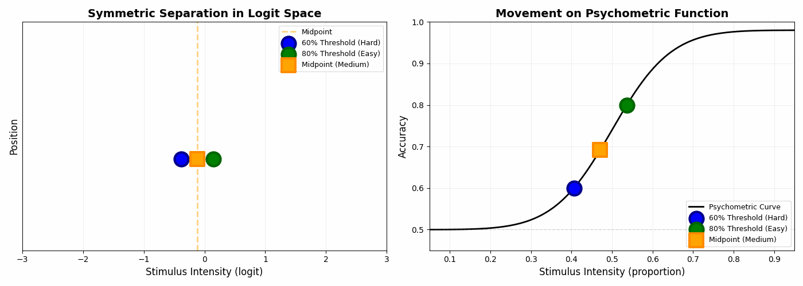

# CDT Experiment Design – Presentation

## Slide 1 — Title & Goal
- Experiment: Control Detection Task (CDT)
- Presenter: <your name>, <affiliation>
- Goal: Quantifying control detection under uncertainty using an adaptive, counterbalanced design

## Slide 2 — Research Question & Motivation
- What is “control detection”? Sense of agency; inferring controllability from sensorimotor contingencies
- Core question: How do cue-driven expectations and motion geometry influence control detection?
- Outcome: Individualized thresholds, principled evidence signal, and rigorous counterbalancing

## Slide 3 — Task Overview (High-level)
- Two moving shapes (square, dot); participant moves mouse and chooses which one they influenced
- Trial flow: cue → motion (up to 5s) → response → ratings (in test blocks)
- Fast responses allowed; keys: A = Square, S = Circle

## Slide 4 — Stimuli & Motion Library
**Creation Process:**
- Pre-recorded human mouse movements transformed into motion snippets (e.g., 120 frames each)
- Velocities extracted, normalized, and clustered using k-means to identify motion types
- StandardScaler normalization ensures consistent feature space across all snippets
- Cluster centroids saved for quality control and future snippet selection

**Properties:**
- Smooth velocities with exponential lowpass filtering (α = 0.5) to reduce jerkiness
- Speed capping at 20 pixels/frame to prevent unrealistic motion bursts
- Universal trajectory set selected per session (best 1,280 snippets based on quality metrics)

**Usage in Trials:**
- Target and distractor always use different trajectories (sampled without replacement)
- Ensures perceptually distinct motion patterns and prevents confounding
- Visual schematic: two shapes following independent, realistic human-like motion paths

## Slide 5 — Trial Timeline & Timing
- Cue (color) encodes expectation; motion runs up to 5s; early response permitted at any time
- Feedback shown in calibration/learning; no feedback in test
- See timeline: 

## Slide 6 — Evidence Signal (How it's computed)
**Formula:** evidence = speed × (cos_T − cos_D)

**Calculation Details:**
- `vm` = mouse velocity vector [dx, dy]
- `speed` = ||vm|| (magnitude of mouse velocity)
- `ut` = normalized target velocity direction (unit vector)
- `ud` = normalized distractor velocity direction (unit vector)
- `cos_T` = dot(vm, ut) / speed (cosine similarity to target)
- `cos_D` = dot(vm, ud) / speed (cosine similarity to distractor)

**Interpretation:**
- **Positive evidence:** Mouse moving more aligned with target than distractor
- **Negative evidence:** Mouse moving more aligned with distractor than target
- **Near zero:** Mouse movement unrelated to either shape, or low speed

**Analysis:**
- We use mean pre-response evidence (duration-normalized) vs. accuracy
- Example: 

## Slide 7 — Calibration Phase (QUEST+)
**Algorithm Overview:**
- Bayesian adaptive procedure that estimates psychometric function parameters
- Two independent staircases (0° and 90°), interleaved to balance trial counts

**Parameter Grids (what we're estimating):**
- **α (threshold):** 61 points from logit(0.05) to logit(0.90) — where participant is ~75% correct
- **β (slope):** 25 points from 1.0 to 12.0 (log-spaced) — steepness of psychometric curve
- **λ (lapse):** 5 points [0.00, 0.01, 0.02, 0.04, 0.06] — probability of random errors
- **γ (guess rate):** fixed at 0.5 for 2AFC

**Priors (calibration uses neutral):**
- α: Gaussian centered at logit(0.625), SD = 1.0 in logit space
- β: Log-normal with mean = 2.5, geometric SD = 2.0
- λ: Uniform across grid points

**Stimulus Selection (entropy-based):**
- For each candidate stimulus, compute expected posterior entropy after observing response
- Select stimulus that maximizes information gain: IG = H(current) − E[H(future)]
- Uses fast approximation (subsample stimulus grid) for real-time performance

**Bayesian Update After Each Trial:**
- Joint posterior: P(α,β,λ | data) ∝ P(data | α,β,λ) × P(α,β,λ)
- Marginalize to get individual posteriors for α, β, λ
- Convergence criterion: SD(α) < threshold OR max trials reached

**Timeout Handling:**
- Timeouts recorded but excluded from QUEST updates and convergence checks
- Prevents biasing threshold estimates with non-informative trials

## Slide 8 — Learning Phase (Cues & Difficulty)
**Individualized Threshold Calculation:**
- From calibration: 60% accuracy threshold (hard) and 80% accuracy threshold (easy)
- Compute midpoint in logit space: z_mid = 0.5 × (logit(s_60) + logit(s_80))
- Apply symmetric separation: D = 1.2 logit units
  - Hard learning level: z_mid − 1.2
  - Easy learning level: z_mid + 1.2
  - Medium (test) level: z_mid

**Cue-Difficulty Mapping:**
- Low precision cue (e.g., blue) → hard learning level
- High precision cue (e.g., green) → easy learning level
- Equal trials per cue, randomized order; feedback shown

**Visualization:**

This ensures perceptually symmetric difficulty while maintaining strong separation for robust learning.

## Slide 9 — Test Phase (Generalization)
- Mixture of “medium” trials and learned-difficulty trials, balanced per cue and shuffled
- Ratings collected after each trial: confidence and agency (1–7); no feedback in test

## Slide 10 — Counterbalancing & Randomization
- Participant-seeded RNG ensures reproducible shuffles per participant
- Angle order counterbalanced (0° first vs 90° first)
- Cue colors counterbalanced; two color palettes randomized across blocks; equal counts per cue
- Prevents confounds between color, angle, expectation, and block order

## Slide 11 — Response Logic & Timeout Policy
- Early responses captured during motion (A=Square, S=Circle)
- Timeouts advance to next stimulus; they do not update QUEST and are excluded from analysis
- Ensures robust thresholds without bias from timeouts

## Slide 12 — Data Logged per Trial
- Core: accuracy, RT, response, true shape, angle bias, cue color, difficulty type
- Evidence metrics: mean/sum/variance; pre-response evidence stats
- Ratings: confidence and agency (test only)
- Kinematics: framewise positions and evidence for detailed analysis

## Slide 13 — Block Structure
- 5 blocks: Calibration → Learn(angle1) → Test(angle1) → Learn(angle2) → Test(angle2)
- Short breaks with countdown; standardized instructions
- See block diagram: 

## Slide 14 — Example Results (Sanity Checks)
- Evidence vs. accuracy scatter + logistic regression (duration-normalized evidence)
- Calibration threshold summaries by angle (0° vs 90°)
- Takeaway: Evidence aligns with accuracy; thresholds converge; design is sensitive and balanced

## Slide 15 — Threats to Validity & Mitigations
- Motor idiosyncrasies → speed capping and smoothing
- Timeouts → excluded from updates/analysis; no repeats, no bias to QUEST
- Trajectory confounds → enforced distinct trajectories; universal set
- Order effects → counterbalanced angles/palettes; seeded RNG

## Slide 16 — Reproducibility & Pipeline
- Deterministic seeding by participant ID; structured CSV outputs
- Analysis scripts live in `Analysis_Scripts/`; artifacts in `Main_Experiment/data/quest_group_analysis/`
- Versioned code; single-file experiment driver with explicit parameters

## Slide 17 — Summary & Next Steps
- Summary: Adaptive calibration, balanced learning/test, principled evidence metric
- Next: Power analysis; more participants; preregistration; extend angles/cues; model comparisons

---

### Backup — QUEST+ Details
- Parameter grids: threshold (alpha), slope (beta), lapse (lambda) with neutral priors
- Stimulus selection via expected information gain; posterior updates per trial

### Backup — Evidence Details
- Framewise construction; handling of near-zero speeds; normalization of motion vectors
- Pre-response aggregation (mean) used for correlation/logistic analyses

### Backup — Logging Schema
- Trial-level fields; kinematic frames; analysis-ready aggregates (pre-RT evidence, etc.)
